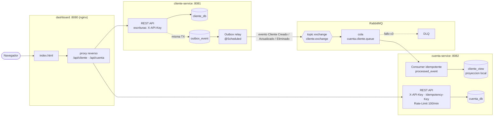
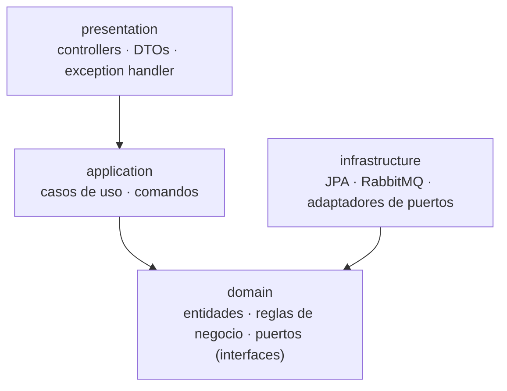
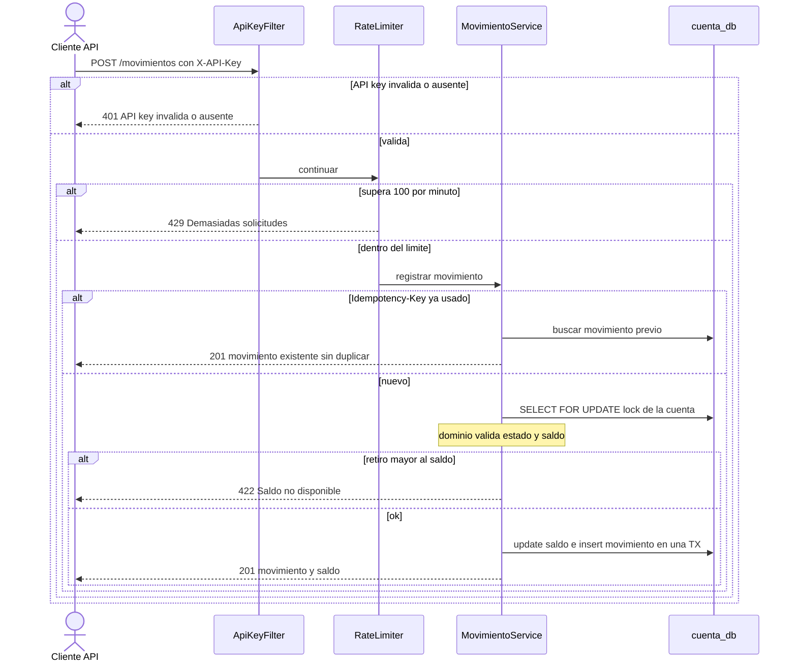
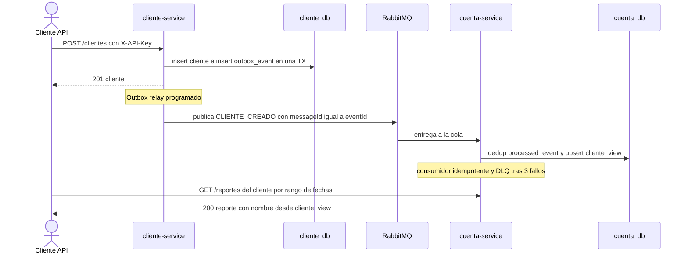

# Devsu Bank — Microservicios (Prueba Técnica)

Solución de microservicios para la gestión de **clientes, cuentas y movimientos
bancarios**, con comunicación **asíncrona** entre servicios, **Clean Architecture**,
manejo de excepciones y un foco explícito en **rendimiento, escalabilidad y
resiliencia**.

> Decisiones técnicas detalladas y su justificación: ver [`DECISIONS.md`](./DECISIONS.md).

---

## Arquitectura



**Mensaje que viaja entre servicios (lo nuevo que se envía):**

```json
{
  "eventId": "f3a1c2e4-...",
  "type": "CLIENTE_CREADO | CLIENTE_ACTUALIZADO | CLIENTE_ELIMINADO",
  "clienteId": 1,
  "nombre": "Marianela Montalvo",
  "estado": true
}
```

Se publica solo lo mínimo necesario para la proyección (`cliente_view`). **No viaja la
contraseña, identificación ni dirección.** El mensaje lleva `messageId = eventId`, que el
consumidor usa para deduplicar (idempotencia); tras 3 fallos va a la **DLQ**.

- **cliente-service**: Persona y Cliente (CRUD). Publica eventos vía **Transactional Outbox**.
  Solo envía lo mínimo que el otro servicio necesita (id, nombre, estado) — **no** propaga
  contraseña, identificación ni dirección.
- **cuenta-service**: Cuenta y Movimiento (CRUD + lógica de saldo + reporte). Consume
  eventos (consumidor **idempotente** vía `processed_event`, con **DLQ**) y mantiene una
  **proyección local** de cliente (`cliente_view`) para que el reporte no dependa de
  llamadas síncronas a otro servicio.
- **Seguridad/control en escrituras**: API Key (`X-API-Key`), `Idempotency-Key` opcional en
  `POST /movimientos`, y rate limiting (100/min) en movimientos.

Cada servicio sigue **Clean Architecture**. La regla de dependencia apunta siempre
hacia el dominio (las flechas indican "depende de"):



El dominio no conoce a Spring/JPA; la infraestructura implementa los puertos definidos
en el dominio (inversión de dependencias).

---

## Stack

Java 21 · Spring Boot 3.3 · Spring Data JPA · Spring AMQP (RabbitMQ) · Flyway ·
PostgreSQL 16 · MapStruct · Lombok · springdoc-openapi (Swagger) · JUnit 5 ·
Mockito · Testcontainers · **Karate** (E2E) · Gradle (wrapper) · Docker Compose.

---

## Cómo ejecutar (solo necesitas Docker)

No requiere Java ni Gradle instalados localmente: el build ocurre dentro de los
contenedores.

```bash
docker-compose up --build
```

Esto levanta: **postgres**, **rabbitmq**, **cliente-service** y **cuenta-service**,
respetando el orden de arranque (healthchecks).

| Servicio | URL |
|----------|-----|
| **Dashboard (monitor)** | **http://localhost:8080** |
| cliente-service | http://localhost:8081 |
| cuenta-service  | http://localhost:8082 |
| Swagger (unificada) | http://localhost:8081/swagger-ui.html — selector arriba a la derecha con **Cliente Service** y **Cuenta Service** (también desde :8082) |
| Health cliente  | http://localhost:8081/actuator/health |
| Health cuenta   | http://localhost:8082/actuator/health |
| RabbitMQ (consola) | http://localhost:15672 (guest/guest) |

Para detener: `docker-compose down` (o `down -v` para borrar datos).

---

## Endpoints

### Clientes (8081)
| Método | Ruta | Descripción |
|--------|------|-------------|
| GET | `/clientes?page=&size=` | Listar (paginado) |
| GET | `/clientes/{id}` | Obtener |
| POST | `/clientes` | Crear |
| PUT | `/clientes/{id}` | Actualizar |
| DELETE | `/clientes/{id}` | Eliminar |

### Cuentas (8082)
| Método | Ruta | Descripción |
|--------|------|-------------|
| GET | `/cuentas?page=&size=` | Listar |
| GET | `/cuentas/{id}` | Obtener |
| POST | `/cuentas` | Crear |
| PUT | `/cuentas/{id}` | Actualizar |

### Movimientos (8082)
| Método | Ruta | Descripción |
|--------|------|-------------|
| GET | `/movimientos?page=&size=` | Listar |
| GET | `/movimientos/{id}` | Obtener |
| POST | `/movimientos` | Registrar (F2). Retiro sin saldo → **422** `{"message":"Saldo no disponible"}` (F3) |
| PUT | `/movimientos/{id}` | Actualizar |

### Reportes (8082)
| Método | Ruta |
|--------|------|
| GET | `/reportes?cliente={id}&fechaInicio={yyyy-MM-dd}&fechaFin={yyyy-MM-dd}` (F4) |

---

## Dashboard de monitoreo

Front muy básico en **http://localhost:8080** (nginx + HTML/JS vanilla, sin build) que
hace **proxy reverso** a ambos servicios (un solo origen → sin CORS). Permite:

- **Estado/health** de cliente-service y cuenta-service (badges, poll cada 5s).
- **Tablas auto-refresh** de clientes, cuentas y movimientos.
- **Reporte F4** por cliente y rango de fechas.
- **Acciones de escritura** (crear cliente/cuenta, registrar movimiento) con campo de
  API key e `Idempotency-Key` opcional; el panel de log evidencia en vivo
  `201 / 422 saldo / 429 / 401`.

---

## Flujos (diagramas de secuencia)

### Registrar movimiento (F2 / F3)



### Alta de cliente y propagación asíncrona (F4 depende de esto)



---

## Seguridad (API Key)

Las operaciones de **escritura** (POST/PUT/DELETE) exigen el header `X-API-Key`.
Las lecturas (GET), Swagger, OpenAPI y Actuator quedan libres. La clave se configura
con la variable de entorno `API_KEY` (por defecto `devsu-secret-key`).

- Falta/incorrecta → **HTTP 401** `{"message":"API key inválida o ausente"}`.

## Datos de ejemplo (seed)

Al levantar, Flyway siembra un cliente (**Marianela Montalvo**, id 1) y su cuenta
(**225487**, saldo 100) en ambas bases, de modo que los endpoints y el reporte F4
funcionan de inmediato sin crear nada.

## Flujo de prueba rápido (curl)

```bash
KEY='devsu-secret-key'

# 1) Crear cliente
curl -X POST http://localhost:8081/clientes -H "X-API-Key: $KEY" -H 'Content-Type: application/json' -d '{
  "nombre":"Marianela Montalvo","genero":"FEMENINO","edad":30,
  "identificacion":"0102030405","direccion":"Quito","telefono":"0991234567",
  "clienteId":"marianela","contrasena":"clave1234","estado":true }'

# 2) Crear cuenta (clienteId = id devuelto arriba)
curl -X POST http://localhost:8082/cuentas -H "X-API-Key: $KEY" -H 'Content-Type: application/json' -d '{
  "numeroCuenta":"770001","tipoCuenta":"CORRIENTE","saldoInicial":100,"estado":true,"clienteId":1 }'

# 3) Depósito (Idempotency-Key opcional evita doble registro en reintentos)
curl -X POST http://localhost:8082/movimientos -H "X-API-Key: $KEY" -H 'Idempotency-Key: dep-001' -H 'Content-Type: application/json' -d '{
  "cuentaId":1,"tipoMovimiento":"DEPOSITO","valor":600 }'

# 4) Retiro que excede el saldo → 422
curl -X POST http://localhost:8082/movimientos -H "X-API-Key: $KEY" -H 'Content-Type: application/json' -d '{
  "cuentaId":1,"tipoMovimiento":"RETIRO","valor":999999 }'

# 5) Reporte (GET, sin API key)
curl "http://localhost:8082/reportes?cliente=1&fechaInicio=2000-01-01&fechaFin=2999-12-31"
```

> **Idempotencia**: repetir el POST con el mismo `Idempotency-Key` devuelve el mismo
> movimiento sin duplicarlo. **Rate limiting**: las escrituras de movimientos están
> limitadas (100/min); al superarlo → **HTTP 429**.

> La colección Postman está en [`postman/DevsuBank.postman_collection.json`](./postman/DevsuBank.postman_collection.json).

---

## Tests

```bash
# Unit + Integración (Testcontainers levanta Postgres y RabbitMQ reales). Requiere Docker.
./gradlew build

# E2E con Karate (requiere los servicios levantados con docker-compose up)
./gradlew :e2e-tests:test -Pe2e
```

- **Unit (F5)**: lógica de saldo (depósito/retiro/saldo insuficiente) — `CuentaTest`, `MovimientoServiceTest`, `ClienteServiceTest`.
- **Integración (F6)**: `MovimientoIntegrationTest` — persistencia, saldo y HTTP 201/422 con Postgres + RabbitMQ reales.
- **E2E**: `e2e-tests/.../banco.feature` — flujo completo incluyendo la propagación asíncrona del cliente.

> **Testcontainers en Docker Desktop (Windows)**: si el build falla con
> `Could not find a valid Docker environment`, exporta el pipe del engine:
> `DOCKER_HOST=npipe:////./pipe/dockerDesktopLinuxEngine`. En CI (Linux) funciona
> sin configuración.

---

## Entregables

- Código fuente (este repositorio).
- `docker-compose.yml` + Dockerfiles multi-stage.
- `BaseDatos.sql` (esquema consolidado; en runtime lo gestiona Flyway).
- Colección Postman (`postman/`).
- `DECISIONS.md` (decisiones técnicas y justificación).
- CI en `.github/workflows/ci.yml`.

---

## Notas de diseño (resumen)

- **Asíncrono + proyección local** → resiliencia y rendimiento del reporte.
- **Transactional Outbox** + **consumidor idempotente** + **DLQ** → entrega garantizada.
- **Bloqueo pesimista** al registrar movimientos → sin sobregiros por concurrencia.
- **BigDecimal**, índices, paginación, HikariCP, `open-in-view:false` → rendimiento.
- **BCrypt**, validación, usuario no-root en contenedores → seguridad.

---

## Convención de idioma (español / inglés)

El código mezcla idiomas **de forma deliberada y consistente**:

- **Dominio y negocio en español** — siguiendo el *lenguaje ubicuo* del enunciado:
  `Cliente`, `Cuenta`, `Movimiento`, `saldo`, `registrarMovimiento`, `SaldoInsuficienteException`.
  Esto mantiene el código alineado con el negocio y con quien define los requisitos.
- **Términos técnicos y de framework en inglés** — convención universal del ecosistema:
  `Repository`, `Service`, `Controller`, `Request`/`Response`, `save`, `findById`, `Mapper`.

Es la práctica habitual en equipos de habla hispana: el *qué* (negocio) en español, el
*cómo* (infraestructura técnica) en inglés. No se traduce terminología estándar de Spring/JPA.
